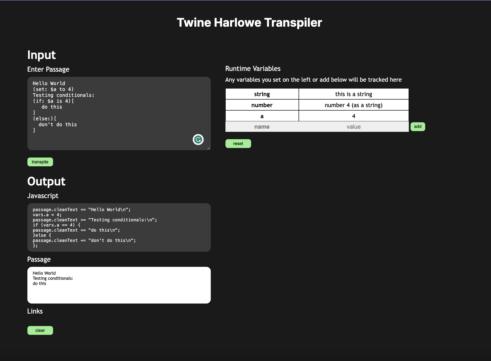

  

# twine-harlowe-transpiler

  

This project is a minimal compiler for Harlowe 3.3.6 and Twine with the integration example in Javascript to support cross-story runtime environments. This was done for a specific project I worked on, but the learning process and development was difficult and incredibly fun for me so I decided to make this it's own repo. It was designed for the purpose of having variables persist beyond one story alone, and having that compilation and runtime environment exist on the client's side. In the example nextjs app I have you can see that as each passage is processed from json, the passage is cleaned, the runtime is updated (and displayed), and the json objects are updated.

</img>

# setup

  

## grammar

For this use case we use `antlr` to take our grammar files and generate files, which we then override in our respective applications. To use them in our applications we again install an `antlr` package, like `npm i antlr4` in the case of node projects. This section pertains to the first use of `antlr` -- and there are two ways to go about doing this I think. The conventional way which I went through is the second option.

### using vscode extension

the `antlr4` vscode extension developed by Mike Lischke [here](https://marketplace.visualstudio.com/items?itemName=mike-lischke.vscode-antlr4) installs antlr4 within vs code and I think you can fiddle with grammars in a sort of sandbox environment, but I didn't experiment with it. Check it out first!

### manual setup

Installing antlr isn't as easy as they make it out to be (atleast for me). Anyways if you're using Windows use [this awesome stack overflow post](https://stackoverflow.com/questions/41021963/how-to-install-antlr4). For any other device, follow antlr page [here](https://github.com/antlr/antlr4/blob/master/doc/getting-started.md#windows) and pray. Once installed you can do the following

#### --> Testing

In the `/testing` folder run the script `test.bat` in the cmd prompt. It will generate all java files and compile them in the testing folder. It will then wait for your input text (type something) and will return the parsed tree after pressing `^Z` and then enter (on Windows). I believe it's `^C` for Mac and Linux but check the antlr setup docs. In the `.bat` file change the last flag from `-gui` to `-tree` depending on what you want (visual tree or textual tree in terminal). Also depending on your setup change the first line to `antlr` or `antlr4`. I aliased it as `antlr` hence the command is written that way

  
  

## running example app

  

You need `node` and `npm` as well as `npx` the latter two I believe come with `node` when installed. Then in the `js-integration/example` directory run `npm install` and then `npm run dev`. This will start the example app locally on port `3000`. Open http://localhost:3000/ in your browser. This is just a sample nextjs app that parses a passage, maintains a runtime of the variables, and evaluates the translated js code.

  

# integration with js projects

  

## updating grammar

  

The language I defined only supports basic things, not even for loops! If you wish to change it, do the following.

1) Go through ANTLR tutorials for grammar and language development setup. There's lots of resources out there on how to build languages.

  

2) Run `antlr -Dlanguage=JavaScript -visitor twine_harlowe.g4` from the `antlr-stuff` directory, it will generate many files but you only need 4

  

3) Copy over the Lexer, Parser, Listener, and Visitor files to the `antlr-files` directory and modify `customListener / customVisitor` accordingly with you're new language files. By default, I used the visitor as it allows for selective walks rather than walking the entire tree (listener)

  

### understanding my grammar

I thought it would be helpful to breakdown how I created my grammar. I did the following:

1. I started with the lexer and created **unambiguous** tokens. Lexer rules are prioritized top down so umbrella rules like one for all alphanumeric characters went at the bottom.

2. I then constructed the language using only these tokens. So if I needed to use a `+` sign I made a lexer rule called `PLUS : '+';` and used the `PLUS` token. You don't need to, I just found doing this made debugging easier.

3. I built up the blocks of a programming language bottom-up, some do it top-down. So I defined expressions, and then conditionals, and then if statements, ... you get the idea. You can actually see this in my grammar if you read it bottom up from the parser rules (lower case ones).  

==> Here are some tips and some info to keep in mind I found useful when learning this.

- parser rules start with a lower case, lexer rules start with upper case, i just made the whole word follow the cases

- parser rules are checked left to right

- for recursive rules, recursive part needs to be stated first, called "Left Recursion" I believe

- if you have some rule A that involves lexer tokens B, C, D and parser rules x, y, z (all arbitrary names), then the children of rule A will precisely be B, C, D, x, y, z and any other characters you used in the rule, all of course in the order they are defined. What this means is that if you want say the word "if" to be a child, and not "i" and "f" as two children, you should make "if" a token!

- think in regex when making rules, consider greedy and non-greedy capturing.

- be cautious with capturing just passage text, i think I struck a sweetspot with this grammar but I tried a lot of alternatives and many of them would match text to things i didn't want text matched to. you have been warned!

## using parser
See the `js-integration/example` app. Essentially, we use the `antlr` generated lexer, parser, and visitor (or listener) to parse input. We maintain a state of the runtime variables and passage, although this doesn't need to be state data. We then use our visitor to convert code into javascript code, as seen in `customVisitor.js` using the `ruleIndex` attribute (set as constants at the beginning of the file). If you add more parser rules these may need to be updated. The `ruleIndex` is literally the index of the parser rule in your `.g4` grammar file, top down, starting at 0.  

`antlr` builds us a nice parser tree, and we use that to generate Javascript code, but how do we execute it? We use a package called `js-interpreter` by Neil Fraser. In our example we used the `npm` package but it is also available as a bundled js file to be attached as a script tag. See [here](https://neil.fraser.name/software/JS-Interpreter/docs.html). From the docs, one can see that we maintain our variables and passage in the `page.tsx` component. However, when interpreting code, we have to serialize these objects into one JSON object to pass it into the interpreter's runtime environment. We do so by defining a wrapper function for the interpreter that loads our data into the runtime environment. This is right from [this tutorial](https://neil.fraser.name/software/JS-Interpreter/demos/json.html). We then define a similar wrapper function to extract that data out and update them in our `page.tsx` component, and that is how we maintain our variable and passage data. 
  

### TODO

  

- not for conditions

- array accesses, although there is a lot of work needed for this

- add for loops & other macros

- make it content plugin-able

- handle frontend strings

  

# restrictions with this tool
(that I know of)
1) **Restriction**: For any plain text that should be rendered in the passage, the following is disallowed:
 `[` `]`, or in words, brackets and quotations. However, curly braces `{ }` and parenthesis are ok.

2) **Restriction**: when defining strings, you must use double quotes

3) **Restriction**: there is a bug with variable references